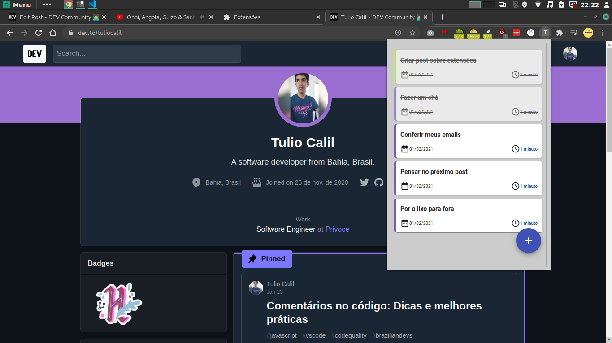

# Criando uma extensão para o Google Chrome com React

<div align="center">



</div>

Este projeto foi utilizado como base para o tutorial que escrevi [aqui no dev.to]().

<hr/>

## 🚀 Rodando o projeto

Para rodar o projeto em modo de desenvolvimento, basta executar:

```bash
yarn start
#ou
npm start
```

## 🔥 Gerando build

Para gerar build e usar a extensão, consulte o post [aqui]().

## 🎯 Me siga

<div align="center">

[](https://www.youtube.com/tuliocalil)
[](https://dev.to/tuliocalil)
[](https://twitter.com/tuliocalil)
[](https://www.linkedin.com/in/tuliocalil/)

### Feito com 💙 na Bahia, Brasil.

</div>
